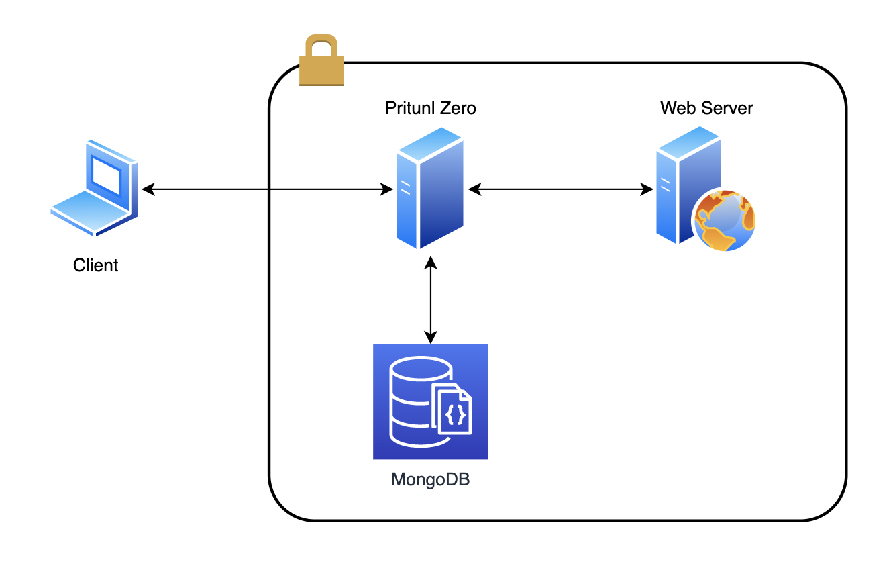

# TP Zero Trust - CPE Lyon - Cybersecurity

TP to learn about Zero Trust applied into a basic infrastructure - CPE Lyon




## 1. Prerequisites

It's recommended to use a GNU/Linux or MacOS

- Install Docker
  - https://docs.docker.com/engine/install/

  - For Debian / Ubuntu / Kali you can use the docker.io project

    ```$ sudo apt install docker.io```

- Install docker-compose
  - https://docs.docker.com/compose/install/ 

  - For Debian / Ubuntu / Kali you can use
    ```$ sudo apt install docker-compose```
## 2. Create the .env file
- copy .env.example to .env 
- personalize the env file (generate passwords)

## 3. Run the docker compose file 

``` docker-compose -f docker-compose.yml up ```
 
## 4. Get the pritunl password

- connect to the docker container
  ``` docker exec -ti pritunl-zero bash```
- run the command
  ``` pritunl-zero default-password```

## 5. Access the Pritunl WebConsole

https://localhost
(you will have to accept the proposed self-signed certificate)

user: pritunl
password: the one recovered in the previous step


## 6. Follow the PDF Guide


****
 ***Remember**: This is a laboratory, **do not** use it in production environments exposed to the internet. Read:* https://docs.pritunl.com/docs/securing-pritunl 
 
 ****